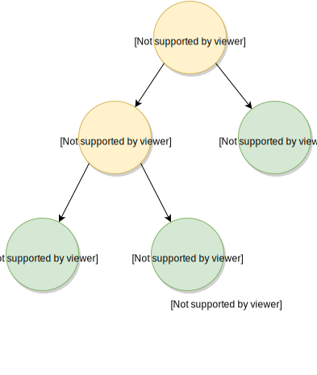

---

layout: default

---

# Яндекс

## **{{ site.presentation.title }}** {#cover}





	
{{ site.author.name }},   {{ site.author.position }}

## О чем доклад
* Два слова о парсерах
    * Что такое
* Где применить
  * Конфиги
  * Языки разметки
  * Язык программирования
  * DSL
* О чем не буду рассказывать
    * Теория
    * Естественные языки

## Примеры языков запросов
* SQL
* Cypher (Neo4j)
* XPath
* Язык запросов к Яндексу

## Задача
* Есть пользователь
* Есть монга
* Нет доверия
* Нет любви

## Синтаксис


author=zubchick AND title~=test OR created>=today()



(author=me() OR author=test_user) AND created="19-08-2015" AND type=bug


## Почему бы не написать пару регулярок
* Кто же вас остановит
* Но это не будет работать
* Это трудно поддерживать
* Трудно расширять

## Шаги
* Лексический анализ
* Парсинг
    * Промежуточное дерево разбора
    * Абстрактное синтаксическое дерево
* Компиляция

## Инструменты
* funcparserlib.lexer
* funcparserlib.parser

<a href="https://github.com/vlasovskikh/funcparserlib">
https://github.com/vlasovskikh/funcparserlib
</a>
 
python 2 и 3

## Пишем свой парсер
{:.section}

### Лексический анализ

## Составные части

### Логические операторы
<pre><code class="language-sql" data-lang="sql">author=zubchick AND title~=test OR created>=today()
</code></pre>

* <code>AND</code>
* <code>OR</code>

## Составные части

### Операторы сравнения
<pre><code class="language-sql" data-lang="sql">author=zubchick AND title~=test OR created>=today()
</code></pre>
* <code>~=</code>
* <code>&gt;=</code>
* <code>&lt;=</code>
* <code>=</code>
* <code>@=</code>
* etc.

## Составные части

### Имена полей
<pre><code class="language-sql" data-lang="sql">author=zubchick AND title~=test OR created>=today()
</code></pre>

## Составные части

### Текст в кавычках и без
<pre><code class="language-sql" data-lang="sql">author=zubchick AND title~=test OR created>=today()
</code></pre>

<pre><code class="language-sql" data-lang="sql">(author=me() OR author=test_user) AND created="19-08-2015" AND type=bug
</code></pre>

## Составные части

### Функции
<pre><code class="language-sql" data-lang="sql">author=zubchick AND title~=test OR created>=today()
</code></pre>

<pre><code class="language-sql" data-lang="sql">(author=me() OR author=test_user) AND created="19-08-2015" AND type=bug
</code></pre>

## Составные части

### Вспомогательные символы
* Скобочки <code>(</code> <code>)</code>
* Пробелы <code>&nbsp;</code> <code>\t</code> <code>\n</code>

## Лексер


from funcparserlib.lexer import make_tokenizer, Token

SPECS = [
    ('CMP', (r'~=|>=|<=|@=|<|>|=',)),
    ('BR', (r'\(|\)',)),
    ('OP', (r'AND|OR',)),
    ('SPACE', (r'[ \t\r\n]+',)),
    ('STRING', (r'"(?:[^"\\]|\\.)*"',)),
    ('WORD', ('\w+',)),
]

tokenizer = make_tokenizer(SPECS)

def tokenize(query):
    return [tok for tok in tokenizer(query) if tok.type != 'SPACE']


## Токен


class Token(object):
    def __init__(self, type, value, start=None, end=None):
        self.type = type
        self.value = value
        self.start = start
        self.end = end


## Проверяем

In [3]: tokenize('author=zubchick AND title~=test OR created>=today()')
Out[3]:
[Token('WORD', 'author'),
 Token('CMP', '='),
 Token('WORD', 'zubchick'),
 Token('OP', 'AND'),
 Token('WORD', 'title'),
 Token('CMP', '~='),
 Token('WORD', 'test'),
 Token('OP', 'OR'),
 Token('WORD', 'created'),
 Token('CMP', '>='),
 Token('WORD', 'today'),
 Token('BR', '('),
 Token('BR', ')')]


## Пишем свой парсер
{:.section}

### Синтаксический анализ

## Грамматика

### Расширенная форма Бэкуса — Наура


expr       = orexpr;

orexpr     = andexpr, {"OR", andexpr};
andexpr    = basexpr, {"AND", basexpr};
basexpr    = "(" expr ")" | fieldexpr;

fieldexpr  = WORD, operator, (function | value);
operator   = "~=" | ">=" | "<=" | "@=" | "<" | ">" | "=";
function   = WORD, "(", ")";
value      = STRING | WORD;


## Теперь тоже самое на python


from funcparserlib.parser import some, a, many, skip, forward_decl

# operator: '~=' | '>=' | '<=' | '<' | '>' | '=' | '@='
operator = some(lambda tok: tok.type == 'CMP')

string = some(lambda tok: tok.type == 'STRING')
word = some(lambda tok: tok.type == 'WORD')

OR = a(Token('OP', 'OR'))
AND = a(Token('OP', 'AND'))


## Field expression


open_brace = skip(a(Token('BR', '(')))
close_brace = skip(a(Token('BR', ')')))
function = word + open_brace + close_brace

value = string | word
fieldexpr = word + operator + (function | value)


## Expression


expr = forward_decl()

basexpr = open_brace + expr + close_brace | fieldexpr
andexpr = basexpr + many(AND + basexpr)
orexpr = andexpr + many(OR + andexpr)
expr.define(orexpr)


## Синтаксис

(author=me() OR author=test_user) AND created="19-08-2015" AND type=bug


## &nbsp;
{:.big-code}


## Весь парсер на одном слайде

operator = some(lambda tok: tok.type == 'CMP')
string = some(lambda tok: tok.type == 'STRING')
word = some(lambda tok: tok.type == 'WORD')

OR = a(Token('OP', 'OR'))
AND = a(Token('OP', 'AND'))

open_brace = skip(a(Token('BR', '(')))
close_brace = skip(a(Token('BR', ')')))
function = word + open_brace + close_brace

value = string | word
fieldexpr = word + operator + (function | value)

expr = forward_decl()

basexpr = open_brace + expr + close_brace | fieldexpr
andexpr = basexpr + many(AND + basexpr)
orexpr = andexpr + many(OR + andexpr)
expr.define(orexpr)


## А вот что было

expr       = orexpr;

orexpr     = andexpr, {"OR", andexpr};
andexpr    = basexpr, {"AND", basexpr};
basexpr    = "(" expr ")" | fieldexpr;

fieldexpr  = WORD, operator, (function | value);
operator   = "~=" | ">=" | "<=" | "@=" | "<" | ">" | "=";
function   = WORD, "(", ")";
value      = STRING | WORD;


## Проверяем


In [8]: expr.parse(tokenize(
            'author=zubchick AND title~=test AND created>=today()'
        ))
Out[8]:
(Token('WORD', 'author'),
 Token('CMP', '='),
 Token('WORD', 'zubchick'),
 [(Token('OP', 'AND'),
   (Token('WORD', 'title'), Token('CMP', '~='), Token('WORD', 'test'))),
  (Token('OP', 'AND'),
   (Token('WORD', 'created'), Token('CMP', '>='), Token('WORD', 'today')))],
 [])


## Синтаксический анализ
{:.section}

### AST

## &nbsp;
{:.big-code}

class AST(object):
    children = ()

class Operator(AST):
    value = None

    def __init__(self, children):
        self.children = children

    def __repr__(self):
        return "%s %s (%s)" % (self.__class__.__name__,
                               self.value, map(repr, self.children))

class LogicalOperator(Operator):
    pass

class CmpOperator(Operator):
    pass


## &nbsp;
{:.big-code}

class Function(AST):
    def __init__(self, text):
        self.name = text.text

    def __repr__(self):
        return "%s()" % (self.name)

class Text(AST):
    def __init__(self, tok):
        self.text = tok.value

    def __repr__(self):
        return "Text(%s)" % self.text

class QuotedText(Text):
    def __init__(self, tok):
        self.text = tok.value[1:-1]



## &nbsp;
{:.big-code}

class AndOp(LogicalOperator):
    value = 'AND'

class OrOp(LogicalOperator):
    value = 'OR'

class GtOp(CmpOperator):
    value = '>'

class LtOp(CmpOperator):
    value = '<'

class LteOp(CmpOperator):
    value = '<='

class GteOp(CmpOperator):
    value = '>='

class RegexOp(CmpOperator):
    value = '~='

class ContainsOp(CmpOperator):
    value = '@='


## Избавляемся от токенов

operator = some(lambda tok: tok.type == 'CMP') >> choose_class

word = some(lambda tok: tok.type == 'WORD') >> Text
string = some(lambda tok: tok.type == 'STRING') >> Text

function = word + open_brace + close_brace >> Function

OR = a(Token('OP', 'OR')) >> lambda _: OrOp
AND = a(Token('OP', 'AND')) >> lambda _: AndOp


## Разворачиваем в дерево
{:.images .two}

*Результат работы парсера andexpr*

*AST*

## Разворачиваем в дерево

def eval(data):
    arg1, lst = data
    for f, arg2 in lst:
        arg1 = f([arg1, arg2])

    return arg1



def eval(data):
    lft, args = data
    return reduce(lambda arg1, (f, arg2): f([arg1, arg2]), args, lft)


## Eval

andexpr = (basexpr + many(AND + basexpr)) >> eval
orexpr = (andexpr + many(OR + andexpr)) >> eval


## Проверяем

author=zubchick AND title~=test OR created>=today()



OrOp
|-- AndOp
|   |-- EqOp
|   |   |-- Text
|   |   `-- Text
|   `-- RegexOp
|       |-- Text
|       `-- Text
`-- GteOp
    |-- Text
    `-- Function


## AST
{:.section}

### Компиляция

## Компиляция запроса в монгу

author=zubchick AND title~=test OR created>=today()



{'$or': [{'$and': [{'author': {'$eq': 'zubchick'}},
                   {'title': {'$regex': 'test'}}]},
         {'created': {'$gte': 1440761425}}]}


## &nbsp;
{:.big-code}

class AndOp(LogicalOperator):
    value = 'AND'
    operator = '$and'

class OrOp(LogicalOperator):
    value = 'OR'
    operator = '$or'

class GtOp(CmpOperator):
    value = '>'
    operator = '$gt'

class RegexOp(CmpOperator):
    value = '~='
    operator = '$regex'

class ContainsOp(CmpOperator):
    value = '@='
    operator = '$in'

...


## &nbsp;
{:.big-code}

class LogicalOperator(Operator):
    def compile(self):
        lft, right = self.children
        return {self.operator: [lft.compile(), right.compile()]}

class CmpOperator(Operator):
    def compile(self):
        lft, right = self.children
        return {left.compile(): {self.operator: right.compile()}}

class Function(AST):
    func_map = {
        'me': os.getlogin,
        'today': lambda: int(datetime.today().strftime('%s')),
    }

    def compile():
        return self.func_map[self.name]()

class Text(AST):
    def compile(self):
        return self.text


## &nbsp;
{:.big-code}

Original query:
author=zubchick AND title~=test OR created>=today()

AST:
OrOp
|-- AndOp
|   |-- EqOp
|   |   |-- Text
|   |   `-- Text
|   `-- RegexpOp
|       |-- Text
|       `-- Text
`-- LteOp
    |-- Text
    `-- Function

Mongo request:
{'$or': [{'$and': [{'author': {'$eq': 'zubchick'}},
                   {'title': {'$regex': 'test'}}]},
         {'created': {'$gte': 1440761756}}]}


## &nbsp;
{:.big-code}

Original query:
(author=me() OR author=test_user) AND created="19-08-2015" AND type=bug

AST:
AndOp
|-- AndOp
|   |-- OrOp
|   |   |-- EqOp
|   |   |   |-- Text
|   |   |   `-- Function
|   |   `-- EqOp
|   |       |-- Text
|   |       `-- Text
|   `-- EqOp
|       |-- Text
|       `-- QuotedText
`-- EqOp
    |-- Text
    `-- Text

Mongo request:
{'$and': [{'$and': [{'$or': [{'author': {'$eq': 'zubchick'}},
                             {'author': {'$eq': 'test_user'}}]},
                    {'created': {'$eq': '19-08-2015'}}]},
          {'type': {'$eq': 'bug'}}]}


## Что можно улучшить
* Добавить операторов
* Добавить функций
* Прокидывать контекст в функцию compile
* Добавить проверку прав
* Оптимизировать дерево
* Генерировать sql после переезда на postrgresql

## **Контакты** {#contacts}

{{ site.author.name }}

{{ site.author.position }}

    

        
zubchick@yandex-team.ru

        
@zubchick

    

